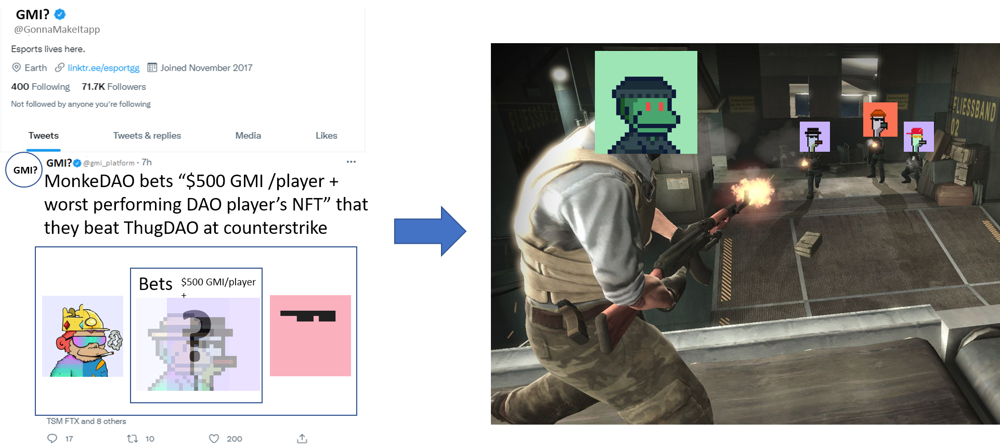
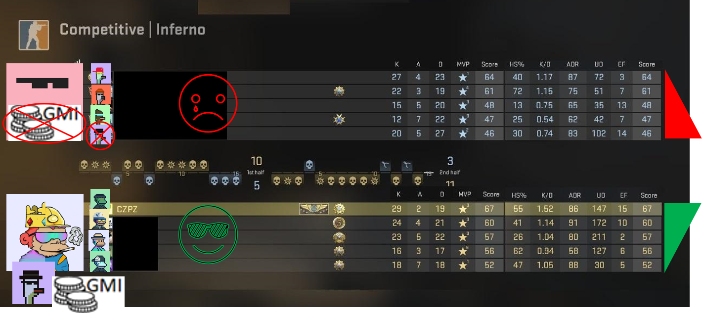

# Multiplayer engine

Decentralized PvP betting in Solana for the most popular games -&#x20;

Anyone can bid anything s/he/they want to challenge anyone to play a game/tournament in existing games. Solana smart contracts (programs) based on the results will distribute the digital assets accordingly among participants. This can be used for Marketing and/or Betting purposes.

e.g. Anyone can challenge anyone anonymously. Only if the challengee accepts to play, people will know who the challenger is.

.png>)

e.g. MonkeDAO bets "$500 GMI/player + worst-performing DAO player's NFT" that they beat ThugDAO at Counter-Strike.

#### League of Legends Multiplayer Engine coming soon

